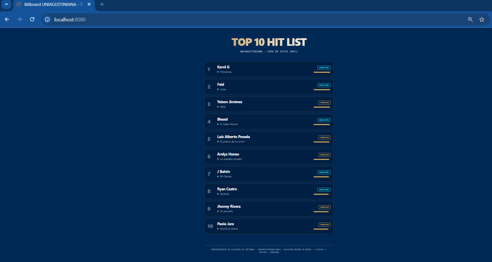

# Evaluación final unidad 3 - v1.0.0
## Uniagustiniana 2026
**Estado:** Stable
**Versionamiento:** SemVer 2.0.0

Este repositorio contiene un laboratorio práctico para el despliegue de una infraestructura distribuida utilizando contenedores. Se implementa un patrón Modelo-Vista-Controlador (MVC) para gestionar un ranking de artistas musicales.

# 🏗️ Componentes del Sistema
Modelo (DB): MariaDB con carga de datos inicial via init.sql.

Controlador (API): FastAPI (Python) que gestiona la lógica y conexión a datos.

Vista (Gateway/UI): Nginx como Proxy Inverso y plantillas Jinja2 con Tailwind CSS.

# 🚀 Guía de Preparación y Ejecución
## 1. Preparar el Entorno (Windows/WSL2)
Antes de iniciar, es vital asegurar que el socket de Podman esté activo y configurado:

PowerShell
## Iniciar el motor de Podman
```batch
podman machine start
```

## Establecer la conexión predeterminada (Evita errores de socket)
```batch
podman system connection default podman-machine-default
```

# Verificar comunicación (Debe mostrar información técnica)
```batch
podman info
```

## 2. Despliegue de la Infraestructura
Ubícate en la raíz del proyecto (evaluacion_final_mss) y ejecuta:

# Construir imágenes y levantar servicios en segundo plano
```batch
podman-compose up -d --build
```
Nota: Usamos -d para evitar errores de compatibilidad con señales de teclado en Windows (NotImplementedError).

## 3. Acceso al Sistema



👉 **[http://localhost:8080](http://localhost:8080)**

🛠️ Comandos de Mantenimiento (Troubleshooting)
Reinicio Total (Borrón y Cuenta Nueva)
Si realizas cambios en el código (main.py) o en la base de datos, sigue este flujo para asegurar un despliegue limpio:


## 1. Detener y borrar contenedores

```batch
podman-compose down
```

## 2. BORRAR EL VOLUMEN (Esto es vital para que vuelva a leer el init.sql)

```batch
podman volume prune -f
```

## 3. Levantar todo de nuevo

```batch
podman-compose up -d --build
```